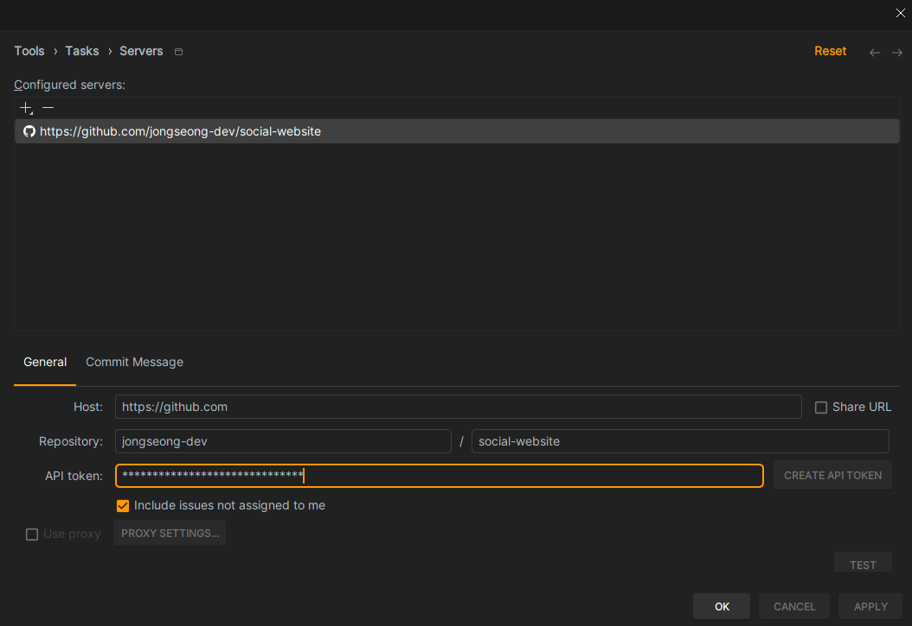

Pycharm으로 Task관리하기

## 공부한 거
-

## 코딩한 거

### Task관리 및 시간 관리
- github project를 활용해서 Task 관리를 하고자 헀다.
- Why?
  - 우리는 프로덕트를 만들기 위한 일정관리를 해야한다. 기획이 있고, 디자인이 있고, 개발을 한다.
  - 여기서 우리가 프로덕트를 만들기 위해 일정이 얼마나 걸리는지 추산을 해야 회사는 그 일정에 발 맞추어 비즈니스를 할 수 있다.
  - 또한 시간을 추적하여 나중에 하나의 기능을 추산할 때 오차범위를 줄여 예측가능한 개발자로 거듭날 수 있도록 한다.
- How?
  - github project를 활용하여 issue를 생성한다.(link: https://github.com/users/jongseong-dev/projects/2/views/1?filterQuery=)
  - Pycharm settings에서 Task Servers로 github repo를 등록한다. 
  
  - 그리고 Alt + Shift + N 또는 상단의 Default Task를 클릭하여 `Open Task`를 눌러 issue를 선택한다.
  - Time Tracking은 Settings 에서 `Time Tracking`을 검색하여 활성화한다.